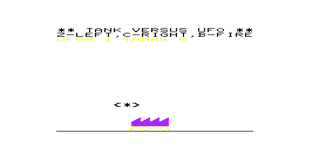
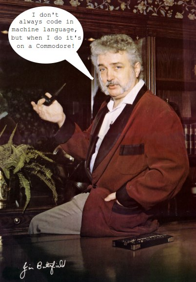

# Commodore                                                

I'm using [VICE 3.2](http://vice-emu.sourceforge.net) on Ubuntu 18.04 x64. Of course you can use a real C64 or C128 if you convert the disk images to floppies. All of my projects include everything you need to boot, compile and run the code.
* `sudo apt-get install build-essential byacc texi2html flex xa65 libreadline-dev libxaw7-dev libgtkmm-3.0-dev libpulse-dev`
* [Download](http://vice-emu.sourceforge.net/index.html#download) latest VICE source and extract.
* `cd vice-3.x` (use actual directory name)
* `./configure --enable-native-gtk3ui`
* `make`
* `sudo make install`
* `x64`

Categories
* [C128 CP/M](https://github.com/sgjava/garage/tree/master/commodore/cpm) Way cool stuff takes CP/M to the next level. Forget Wordstar, how about games, graphics, digital sound, graphical UIs, custom characters, windows, etc. C, Pacsal and Z80 Assembler APIs that allows easy access to the C128's unique hardware.
* [C64](https://github.com/sgjava/garage/tree/master/commodore/c64) Games, digital sound experiments, and other stuff.

Published articles
* [Easy Keys](https://raw.githubusercontent.com/sgjava/garage/master/commodore/images/Commodore_Magazine_Vol-09-N03_1988_Mar.png) - Commodore Magazine, Volume 9, Number 3, March 1988, page 64
* [Turbo Charging CP/M with "SG Tools Programmer's Toolbox"](https://github.com/sgjava/garage/blob/master/commodore/images/Twin_Cities_128_Issue_32_1992_Jul.png) - Twin Cities 128, Issue 32, July 1992, pages 23 - 29
* [CP/M Tools](https://github.com/sgjava/garage/blob/master/commodore/images/Twin_Cities_128-64_Issue%2033_1993_Jan.png) - Twin Cities 128, Issue 33, January 1993, pages 35 - 41
* [Digiblaster 64](https://github.com/sgjava/garage/blob/master/commodore/images/Twin_Cities_128-64_Issue_34_1993_Aug_db64.png) - Twin Cities 128, Issue 34, August 1993, pages 11 - 13
* [Turbo Charging CP/M](https://github.com/sgjava/garage/blob/master/commodore/images/Twin_Cities_128-64_Issue_34_1993_Aug_cpm.png) - Twin Cities 128, Issue 34, August 1993, pages 14 - 22
* [High-Tech C review](https://github.com/sgjava/garage/blob/master/commodore/images/Twin_Cities_128-64_Issue_36.png) - Twin Cities 128, Issue 36, pages 16 - 19

Tanks versus UFO by Duane Later

The first programs I typed in circa 1981 were in the back of the VIC 20 manual from Duane Later. They were very primitive, but at least you could understand how basic game logic worked. The first game I bought for the VIC 20 was Blue Meanies from Outer Space. Same author, but using a redefined character set and machine language it kicked it up to the next level. That game really started me developing games using BASIC and machine language. I wrote some pretty cool stuff back then, but I was never able to recover it from tape in 2005 during my conversion project. When I looked around for Duane Later there wasn't much out there. Only that he worked at the beginning of the VIC 20 project.

If you were involved in the early days of Commodore development then you have to tip your hat to [Jim Butterfield](https://en.wikipedia.org/wiki/Jim_Butterfield). His excellent memory maps, articles and books opened up Commodore's hardware to me and many others I'm sure. That was the difference between generic BASIC programs you could run on any computer and building unique Commodore programs. If you had to roll up your sleeves and write machine language for performance reasons then that's what you did. It pushed me to the next level.

### FreeBSD License
Copyright (c) Steven P. Goldsmith

All rights reserved.

Redistribution and use in source and binary forms, with or without modification, are permitted provided that the following conditions are met:
* Redistributions of source code must retain the above copyright notice, this list of conditions and the following disclaimer.
* Redistributions in binary form must reproduce the above copyright notice, this list of conditions and the following disclaimer in the documentation and/or other materials provided with the distribution.

THIS SOFTWARE IS PROVIDED BY THE COPYRIGHT HOLDERS AND CONTRIBUTORS "AS IS" AND ANY EXPRESS OR IMPLIED WARRANTIES, INCLUDING, BUT NOT LIMITED TO, THE IMPLIED WARRANTIES OF MERCHANTABILITY AND FITNESS FOR A PARTICULAR PURPOSE ARE DISCLAIMED. IN NO EVENT SHALL THE COPYRIGHT HOLDER OR CONTRIBUTORS BE LIABLE FOR ANY DIRECT, INDIRECT, INCIDENTAL, SPECIAL, EXEMPLARY, OR CONSEQUENTIAL DAMAGES (INCLUDING, BUT NOT LIMITED TO, PROCUREMENT OF SUBSTITUTE GOODS OR SERVICES; LOSS OF USE, DATA, OR PROFITS; OR BUSINESS INTERRUPTION) HOWEVER CAUSED AND ON ANY THEORY OF LIABILITY, WHETHER IN CONTRACT, STRICT LIABILITY, OR TORT (INCLUDING NEGLIGENCE OR OTHERWISE) ARISING IN ANY WAY OUT OF THE USE OF THIS SOFTWARE, EVEN IF ADVISED OF THE POSSIBILITY OF SUCH DAMAGE.

